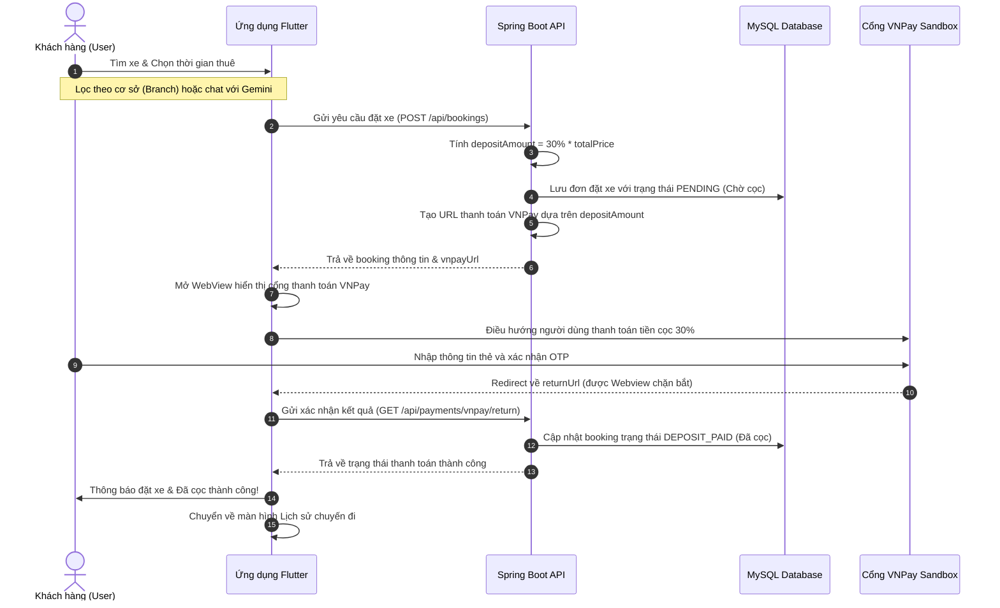

# GoRento — Nhật Ký Cập Nhật & Quy Trình Refactor Hệ Thống

Tài liệu này ghi lại toàn bộ quy trình chi tiết về việc tối ưu hóa giao diện (UI/UX), tái cấu trúc cơ sở dữ liệu (Database), loại bỏ phân quyền Owner, thay đổi luồng đặt cọc thanh toán mới và tích hợp trợ lý ảo Chatbot AI Gemini 2.0 Flash.

---

## 1. Danh Sách Các Thay Đổi & Tính Năng Mới

### 1.1. Tối Ưu Hóa Giao Diện & Trải Nghiệm (UI/UX Refresh)
* **Font chữ & Typography**: Chuyển đổi toàn bộ font chữ mặc định của hệ thống sang font **Inter** hiện đại và cao cấp hơn. Điều chỉnh thuộc tính `line-height` và độ dày chữ trong [app_theme.dart](file:///Users/huy/Documents/THUE/booking-vehicle-system/flutter_app/lib/src/core/theme/app_theme.dart).
* **Bố cục & Spacing**: Tăng cường khoảng cách/đệm (`padding`, `margin`, `SizedBox` height/width) giữa các thành phần (bảng nhập liệu, thẻ hiển thị danh sách xe, chi tiết chuyến đi) giúp bố cục màn hình thoáng đãng, dễ đọc hơn.
* **Debug Banner**: Tắt vĩnh viễn banner màu đỏ chữ "DEBUG" ở góc phải màn hình của ứng dụng Flutter trong [app.dart](file:///Users/huy/Documents/THUE/booking-vehicle-system/flutter_app/lib/src/app.dart) bằng cách thiết lập `debugShowCheckedModeBanner: false`.
* **Static Analysis**: Sửa sạch toàn bộ lỗi và cảnh báo phân tích tĩnh (`flutter analyze` trả về `No issues found!`), thay thế các biến callback không dùng dạng `(_, __)` trong ListView Builder để tuân thủ quy tắc lint `unnecessary_underscores`.

### 1.2. Tái Cấu Trúc Phân Quyền & Chi Nhánh (Role & Branch Refactoring)
* **Loại bỏ vai trò `OWNER`**: 
  * Hệ thống giờ đây chỉ tập trung vào 2 vai trò cốt lõi: **`USER`** (Khách hàng thuê xe) và **`ADMIN`** (Quản trị viên hệ thống kiêm quản lý xe/chi nhánh).
  * Di chuyển toàn bộ các tài khoản có vai trò `OWNER` cũ sang vai trò `ADMIN` thông qua script database.
  * Xóa bỏ hoàn toàn các màn hình, routes và mã nguồn liên quan đến Owner ở cả Frontend (thư mục `flutter_app/lib/src/features/owner` cũ) và Backend (các controller dành riêng cho Owner cũ như `OwnerBookingController`, `OwnerCarController`, v.v.).
* **Hỗ trợ đa chi nhánh (Multi-branch)**:
  * Thiết lập bảng `branch` mới để lưu thông tin các cơ sở (Tên chi nhánh, Địa chỉ, Số điện thoại, Kinh độ/Vĩ độ bản đồ).
  * Liên kết mỗi xe (`car`) thuộc về duy nhất một chi nhánh cụ thể thông qua khoá ngoại `branch_id`.

### 1.3. Luồng Đặt Xe - Đặt Cọc (30%) - Trả Xe Mới
* **Luồng đặt cọc giữ xe**:
  * Khi đặt xe, hệ thống sẽ tự động tính toán số tiền đặt cọc cần trả trước là **30%** tổng giá trị đơn thuê (`depositAmount` = 30% * `totalPrice`), lưu trực tiếp vào bảng `booking`.
  * Sau khi bấm đặt xe tại [booking_create_screen.dart](file:///Users/huy/Documents/THUE/booking-vehicle-system/flutter_app/lib/src/features/bookings/booking_create_screen.dart), thay vì chuyển sang trạng thái đã đặt ngay, hệ thống sẽ lập tức điều hướng người dùng tới màn hình WebView kết nối trực tiếp cổng thanh toán VNPay Sandbox để thanh toán số tiền cọc 30% này.
* **Cập nhật vòng đời chuyến đi (`BookingStatus`)**:
  * Hệ thống hỗ trợ các trạng thái mới: `PENDING` (Chờ cọc) $\rightarrow$ `DEPOSIT_PAID` (Đã cọc) $\rightarrow$ `CONFIRMED` (Đã duyệt) $\rightarrow$ `RENTING` (Đang thuê) $\rightarrow$ `RETURNED` (Đã trả xe) $\rightarrow$ `COMPLETED` (Hoàn tất) hoặc `CANCELLED` (Đã hủy).
* **Luồng Trả Xe**:
  * Bổ sung nút bấm **"Trả xe"** trực tiếp trên màn hình [booking_detail_screen.dart](file:///Users/huy/Documents/THUE/booking-vehicle-system/flutter_app/lib/src/features/bookings/booking_detail_screen.dart) cho khách hàng khi trạng thái chuyến đi là `RENTING`. 
  * Khi khách hàng bấm nút, ứng dụng sẽ gọi API gửi yêu cầu trả xe và cập nhật trạng thái đơn thành `RETURNED`. Admin sẽ kiểm tra xe thực tế và bấm nút duyệt để chuyển trạng thái thành `COMPLETED` (kết thúc chuyến đi).

### 1.4. Tích Hợp Trợ Lý Ảo Chatbot AI (Gemini 2.0 Flash)
* **Backend**:
  * Tạo dịch vụ [GeminiService.java](file:///Users/huy/Documents/THUE/booking-vehicle-system/backend/src/main/java/vehicle/booking/service/GeminiService.java) kết nối tới API Gemini 2.0 Flash của Google bằng RestTemplate.
  * Phân tích câu hỏi tiếng Việt tự nhiên của người dùng (ví dụ: *"tìm xe 7 chỗ số tự động khoảng 1 triệu đổ lại ở Cầu Giấy"*), trích xuất và chuyển đổi thành cấu trúc tham số tìm kiếm JSON chuẩn hóa (hãng xe, số chỗ, khoảng giá, loại nhiên liệu, chi nhánh).
  * Hỗ trợ cơ chế tự động phân tích từ khóa (Keyword-based Fallback) nếu API Gemini bị lỗi hoặc mất mạng.
* **Frontend**:
  * Tích hợp Floating Action Button (FAB) chatbot hình tròn nổi bật ở góc phải màn hình trang chủ [main_layout.dart](file:///Users/huy/Documents/THUE/booking-vehicle-system/flutter_app/lib/src/features/home/main_layout.dart).
  * Màn hình chatbot [chatbot_screen.dart](file:///Users/huy/Documents/THUE/booking-vehicle-system/flutter_app/lib/src/features/chatbot/chatbot_screen.dart) hỗ trợ hiệu ứng bong bóng chat đẹp mắt, hiệu ứng gõ chữ sinh động (Typing indicator/animation) và hiển thị các thẻ xe đề xuất trực quan để người dùng có thể nhấp trực tiếp xem chi tiết.

---

## 2. Chi Tiết Các File Đã Chỉnh Sửa & Tạo Mới

### 2.1. Backend (Java Spring Boot)

* **Database Migration**:
  * [V20260706_0012__add_branch_and_refactor_roles.sql](file:///Users/huy/Documents/THUE/booking-vehicle-system/backend/src/main/resources/db/migration/V20260706_0012__add_branch_and_refactor_roles.sql): Script SQL tạo bảng `branch`, thêm cột `branch_id` vào bảng `car` cùng ràng buộc khoá ngoại, bổ sung cột `deposit_amount` vào bảng `booking`, chuyển đổi role `OWNER` $\rightarrow$ `ADMIN`, và chèn dữ liệu mẫu các chi nhánh (Hoàn Kiếm, Cầu Giấy, Thanh Xuân).
* **Entities & Enums**:
  * [Branch.java](file:///Users/huy/Documents/THUE/booking-vehicle-system/backend/src/main/java/vehicle/booking/entity/Branch.java) `[NEW]`: Thực thể đại diện cho chi nhánh cơ sở.
  * [Car.java](file:///Users/huy/Documents/THUE/booking-vehicle-system/backend/src/main/java/vehicle/booking/entity/Car.java) `[MODIFY]`: Thêm liên kết `@ManyToOne` với `Branch`, loại bỏ các trường và quan hệ liên quan tới `owner_id`.
  * [Booking.java](file:///Users/huy/Documents/THUE/booking-vehicle-system/backend/src/main/java/vehicle/booking/entity/Booking.java) `[MODIFY]`: Thêm trường `depositAmount` để ghi nhận số tiền cọc 30%.
  * [BookingStatus.java](file:///Users/huy/Documents/THUE/booking-vehicle-system/backend/src/main/java/vehicle/booking/entity/enums/BookingStatus.java) `[MODIFY]`: Bổ sung các trạng thái `PENDING`, `DEPOSIT_PAID`, `RENTING`, `RETURNED`.
* **Controllers & Services**:
  * [BranchController.java](file:///Users/huy/Documents/THUE/booking-vehicle-system/backend/src/main/java/vehicle/booking/controller/BranchController.java) `[NEW]`: Cung cấp API lấy danh sách chi nhánh công khai.
  * [BranchService.java](file:///Users/huy/Documents/THUE/booking-vehicle-system/backend/src/main/java/vehicle/booking/service/BranchService.java) `[NEW]`: Logic nghiệp vụ truy xuất thông tin chi nhánh.
  * [ChatbotController.java](file:///Users/huy/Documents/THUE/booking-vehicle-system/backend/src/main/java/vehicle/booking/controller/ChatbotController.java) `[NEW]`: Cung cấp API `/api/chatbot/ask` công khai.
  * [GeminiService.java](file:///Users/huy/Documents/THUE/booking-vehicle-system/backend/src/main/java/vehicle/booking/service/GeminiService.java) `[NEW]`: Kết nối và xử lý logic với Generative Language API của Google.
  * [BookingServiceImpl.java](file:///Users/huy/Documents/THUE/booking-vehicle-system/backend/src/main/java/vehicle/booking/service/impl/BookingServiceImpl.java) `[MODIFY]`: Cập nhật logic tính 30% tiền cọc khi tạo booking, tự động thiết lập trạng thái ban đầu là `PENDING` và cập nhật logic chuyển trạng thái. Thêm API xử lý khi người dùng yêu cầu trả xe.
* **Security & CORS**:
  * [SecurityConfig.java](file:///Users/huy/Documents/THUE/booking-vehicle-system/backend/src/main/java/vehicle/booking/config/SecurityConfig.java) `[MODIFY]`: Loại bỏ cấu hình bảo mật dành riêng cho vai trò `OWNER`. Cấp quyền truy cập công khai không cần token cho các API chatbot `/api/chatbot/**` và chi nhánh `/api/branches/**`. Cấu hình cho phép CORS từ origin IP LAN `http://10.1.1.179:*` phục vụ debug trên Chrome Web/Thiết bị khác.
* **Properties**:
  * [application-dev.properties](file:///Users/huy/Documents/THUE/booking-vehicle-system/backend/src/main/resources/application-dev.properties) `[NEW]`: Cấu hình chạy thử nghiệm local với database MySQL (mật khẩu `root`) và IP LAN `10.1.1.179` cho VNPay return URL.

### 2.2. Frontend (Flutter Mobile & Web)

* **Configuration**:
  * [.env.json](file:///Users/huy/Documents/THUE/booking-vehicle-system/flutter_app/.env.json) `[MODIFY]`: Cấu hình lại `BASE_URL` trỏ tới IP LAN của máy host `http://10.1.1.179:8080`.
* **Routing & Theme**:
  * [app_router.dart](file:///Users/huy/Documents/THUE/booking-vehicle-system/flutter_app/lib/src/core/router/app_router.dart) `[MODIFY]`: Xóa toàn bộ các routes có prefix `/owner`. Thêm các tuyến đường mới `/chatbot` cho màn hình AI Chatbot và `/payment-webview` cho WebView thanh toán VNPay.
  * [app_theme.dart](file:///Users/huy/Documents/THUE/booking-vehicle-system/flutter_app/lib/src/core/theme/app_theme.dart) `[MODIFY]`: Chuyển font hệ thống sang Google Fonts Inter, điều chỉnh padding/spacing của `InputDecorationTheme`, `CardTheme`.
* **Screens & Layout**:
  * [main_layout.dart](file:///Users/huy/Documents/THUE/booking-vehicle-system/flutter_app/lib/src/features/home/main_layout.dart) `[MODIFY]`: Tích hợp Floating Action Button (FAB) dẫn tới màn hình `/chatbot`.
  * [home_screen.dart](file:///Users/huy/Documents/THUE/booking-vehicle-system/flutter_app/lib/src/features/home/home_screen.dart) `[MODIFY]`: Thêm thanh trượt ngang (Horizontal Branch List Slider) hiển thị danh sách các chi nhánh và số lượng xe hiện có của chi nhánh đó.
  * [car_list_screen.dart](file:///Users/huy/Documents/THUE/booking-vehicle-system/flutter_app/lib/src/features/cars/car_list_screen.dart) `[MODIFY]`: Hỗ trợ lọc danh sách xe linh hoạt theo chi nhánh được truyền vào từ màn hình chủ.
  * [chatbot_screen.dart](file:///Users/huy/Documents/THUE/booking-vehicle-system/flutter_app/lib/src/features/chatbot/chatbot_screen.dart) `[NEW]`: Giao diện chatbot thông minh với hiệu ứng gõ chữ, tin nhắn bong bóng và hiển thị các gợi ý thẻ xe.
  * [booking_create_screen.dart](file:///Users/huy/Documents/THUE/booking-vehicle-system/flutter_app/lib/src/features/bookings/booking_create_screen.dart) `[MODIFY]`: Cập nhật hiển thị số tiền đặt cọc 30% và tự động chuyển hướng WebView VNPay ngay sau khi tạo booking thành công.
  * [booking_detail_screen.dart](file:///Users/huy/Documents/THUE/booking-vehicle-system/flutter_app/lib/src/features/bookings/booking_detail_screen.dart) `[MODIFY]`: Hiển thị chi tiết số tiền cọc 30%, cập nhật hiển thị 7 trạng thái mới và hiển thị nút bấm **"Trả xe"** khi trạng thái xe đang thuê là `RENTING`.

---

## 3. Sơ Đồ Luồng Nghiệp Vụ Đặt Xe Mới



---

## 4. Hướng Dẫn Chạy Thử Nghiệm

### Bước 1: Chuẩn bị Database MySQL
* Đảm bảo MySQL đang chạy trên cổng `3306` (Mật khẩu: `root`).
* Cơ sở dữ liệu tên là `vehicle_booking` đã được tạo sẵn. Khi khởi chạy, Flyway sẽ tự động chạy toàn bộ các script migration mới nhất.

### Bước 2: Khởi chạy Backend Spring Boot
* Di chuyển tới thư mục `backend/` và khởi chạy dịch vụ bằng Gradle:
  ```bash
  cd backend
  ./gradlew bootRun
  ```
* Dịch vụ sẽ lắng nghe trên cổng `8080` của máy tính.

### Bước 3: Khởi chạy ứng dụng Flutter (Web Chrome / Mobile)
* Di chuyển tới thư mục `flutter_app/`.
* Cài đặt đầy đủ dependencies:
  ```bash
  cd flutter_app
  flutter pub get
  ```
* **Chạy thử trên Chrome Web**:
  ```bash
  flutter run -d chrome --dart-define-from-file=.env.json
  ```
* **Chạy thử trên Máy ảo / Thiết bị thật Android**:
  * Kết nối thiết bị/mở máy ảo Android lên.
  * Chạy lệnh:
    ```bash
    flutter run --debug --dart-define-from-file=.env.json
    ```
